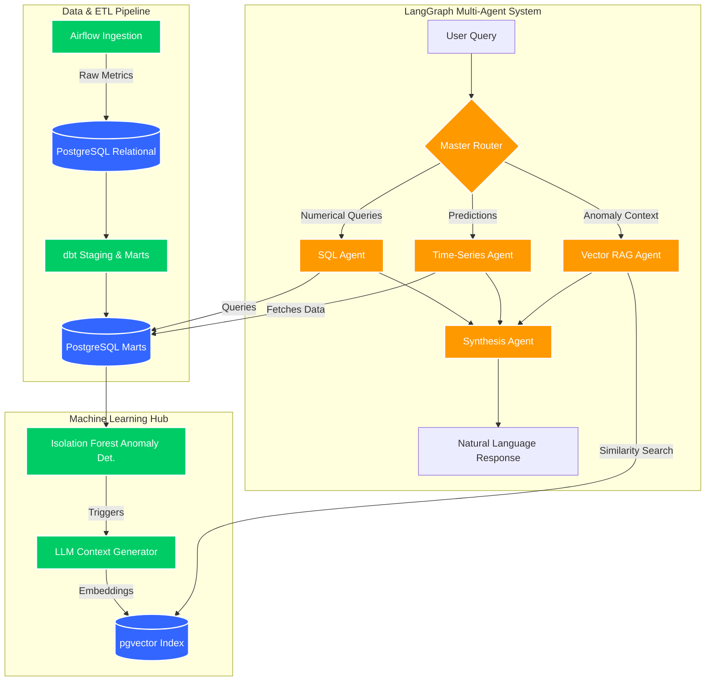

# 📈 Agentic RAG for Time-Series Analysis


An end-to-end multi-agent Retrieval-Augmented Generation (RAG) system built to provide a conversational interface for complex time-series data. This architecture seamlessly merges traditional data engineering (Airflow, dbt, Postgres), machine learning (ARIMA, XGBoost, Isolation Forests), and modern AI orchestration (LangGraph, OpenAI) to dynamically answer complex questions about past metrics, future forecasts, and contextual anomaly explanations.

---

## 🏗️ Architecture Overview

The system is designed in a highly modular, 5-phase architecture:



---

## ⚙️ Technical Details

### Phase 1: Data Storage (`pgvector`)
We use a unified **PostgreSQL 16** instance as both a traditional analytical warehouse and a Vector Database.
*   **Relational Schema:** Stores raw metrics (`timestamp`, `metric_name`, `metric_value`).
*   **Vector Schema:** Uses the `pgvector` extension with HNSW indexing to store `VECTOR(1536)` embeddings of anomaly summaries.

### Phase 2: ETL Pipeline (Airflow & dbt)
*   **Apache Airflow:** Orchestrates daily data generation/ingestion.
*   **dbt (Data Build Tool):** Transforms raw data into staging and mart models, aggregating metrics to the hourly level and computing critical ML features (rolling averages, 1h/24h lag variables, standard deviations).

### Phase 3: Time-Series Modeling Hub
A dedicated Python module (`time_series_hub.py`) housing standard algorithms:
*   **ARIMA:** For baseline univariate forecasting.
*   **XGBoost:** For multivariate forecasting utilizing dbt-generated lag features.
*   **Isolation Forests:** For unsupervised anomaly detection. Anomalies trigger an LLM (GPT-3.5) to write a short contextual summary, which is embedded via `text-embedding-3-small` and saved to `pgvector`.

### Phase 4 & 5: LangGraph Agents
A stateful, multi-agent workflow orchestrated via LangGraph:
1.  **Master Router:** Uses LLM intent recognition to decide which specialized agents are needed.
2.  **SQL Agent:** Safely fetches precise historical numerical data from dbt marts.
3.  **Time-Series Agent:** Dynamically runs ARIMA/XGBoost to generate live future forecasts.
4.  **Vector RAG Agent:** Performs semantic search in `pgvector` to find explanations for past anomalies.
5.  **Synthesis Agent:** Ingests the raw numbers, the forecast arrays, and the RAG context to formulate a highly accurate, conversational response to the user.

---

## 🚀 Getting Started

### Prerequisites
*   Docker & Docker Compose
*   Python 3.10+
*   OpenAI API Key

### Installation

1.  **Start the Database:**
    ```bash
    # Spins up PostgreSQL with pgvector and initializes the schemas
    docker compose up -d
    ```

2.  **Install Dependencies:**
    ```bash
    pip install -r requirements.txt 
    # (Ensure you install apache-airflow, dbt-postgres, xgboost, scikit-learn, langgraph, langchain-openai, sqlalchemy, pandas, statsmodels)
    ```

3.  **Setup Environment Variables:**
    ```bash
    export OPENAI_API_KEY="your-api-key-here"
    ```

4.  **Run the LangGraph Application:**
    ```bash
    python agents/main_graph.py
    ```

---
*Generated as part of the Agentic RAG for Time-Series Analysis architecture build.*
