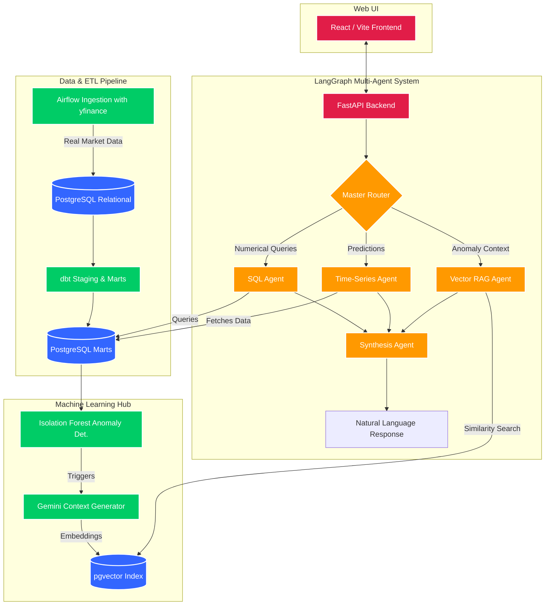

# 📈 Agentic RAG for Time-Series Analysis


An end-to-end multi-agent Retrieval-Augmented Generation (RAG) system built to provide a conversational interface for complex time-series data. This architecture seamlessly merges traditional data engineering (Airflow, dbt, Postgres), machine learning (ARIMA, XGBoost, Isolation Forests), and modern AI orchestration (LangGraph, OpenAI) to dynamically answer complex questions about past metrics, future forecasts, and contextual anomaly explanations.

---

## 🏗️ Architecture Overview

The system is designed in a highly modular, full-stack architecture:



---

## ⚙️ Technical Details

### Phase 1: Data Storage (`pgvector`)
We use a unified **PostgreSQL 16** instance as both a traditional analytical warehouse and a Vector Database.

### Phase 2: ETL Pipeline (Airflow & dbt)
*   **Apache Airflow:** Orchestrates daily ingestion of real stock market data (Apple, Google, S&P 500) via `yfinance`.
*   **dbt (Data Build Tool):** Transforms raw data into staging and mart models, generating critical ML features (rolling averages, 1h/24h lag variables, standard deviations).

### Phase 3: Time-Series Modeling Hub
A dedicated Python module (`time_series_hub.py`) housing standard algorithms:
*   **ARIMA:** For baseline univariate forecasting.
*   **XGBoost:** For multivariate forecasting utilizing dbt-generated lag features.
*   **Isolation Forests:** For unsupervised anomaly detection. Anomalies trigger **Gemini** to write a short contextual summary, which is embedded via `GoogleGenerativeAIEmbeddings` and saved to `pgvector`.

### Phase 4 & 5: LangGraph Agents & Full-Stack UI
A stateful, multi-agent workflow orchestrated via LangGraph, exposed through a Web UI:
1.  **FastAPI Backend:** Provides the API layer for the agentic workflow.
2.  **React (Vite) Frontend:** A premium, dark-mode web application featuring real-time chat and dynamic `Recharts` graphs overlaying historical data with AI forecasts.
3.  **Agents:** Master Router, SQL Agent, Time-Series Agent, Vector RAG Agent, and Synthesis Agent work together utilizing **Gemini 1.5 Flash** to analyze data and synthesize conversational responses.

---

## 🚀 Getting Started

### Prerequisites
*   Docker & Docker Compose
*   Python 3.10+
*   OpenAI API Key

### Installation

1.  **Start the Database:**
    ```bash
    # Spins up PostgreSQL with pgvector and initializes the schemas
    docker compose up -d
    ```

2.  **Install Dependencies & Seed Data:**
    ```bash
    pip install -r requirements.txt 
    
    # Run the standalone script to download real stock data into your database
    python seed_data.py
    ```

3.  **Setup Environment Variables:**
    Ensure you have a `.env` file with your `GOOGLE_API_KEY`.

4.  **Run the Backend & Frontend:**
    Start the FastAPI backend:
    ```bash
    uvicorn backend.main:app --reload
    ```
    In a new terminal, start the React frontend:
    ```bash
    cd frontend
    npm install
    npm run dev
    ```

---
*Generated as part of the Agentic RAG for Time-Series Analysis architecture build.*
